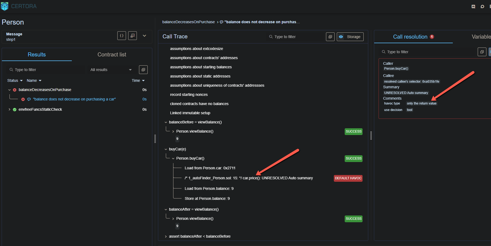

# Run Analysis

## Reports
### verifyStep1.sh: [Verification Report][step1report]  

[step1report]: https://prover.certora.com/output/52228/cf361ad8e74b4fc9a7c4d6819462858e?anonymousKey=34faa6ab68ae76e5fa84673ea05b514f6b879e66

## Analysis
### verifyStep1.sh: 
  

The rule fails as the Prover is able to create a counter-example where `car.price() = 0`. 
This happens because the `Car` contract is an external one and when `car.price()` method is called from `Person` contracts's `buyCar()`, it has no knowledge of it. So, it creates a value which is capable of breaking the rule. And hence you see the `DEFAULT HAVOC` message in the verification report.

We need to somehow tell the Prover to call the correct `car.price()` function.
