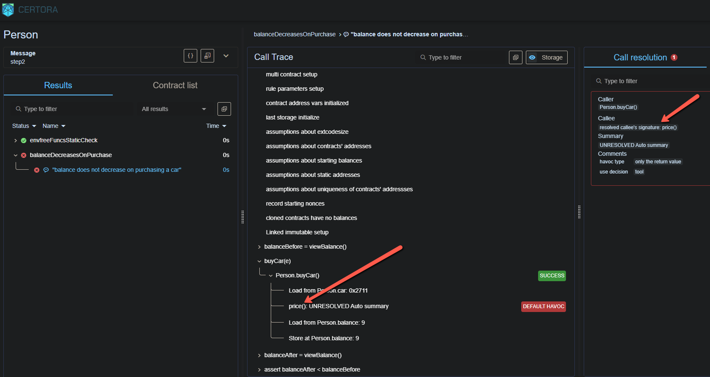
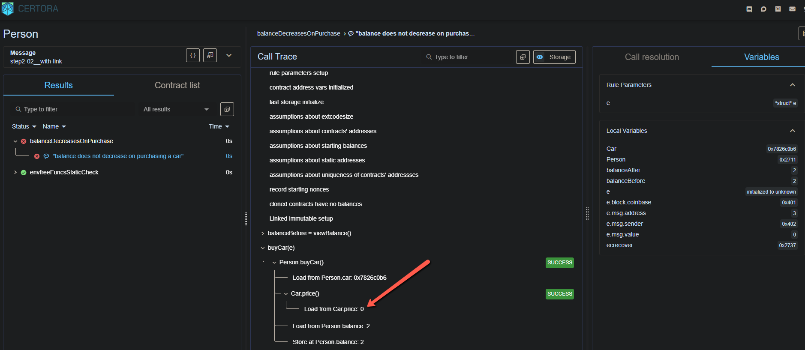

# Run Analysis

## Reports
### verifyStep2_01.sh: [Verification Report](https://prover.certora.com/output/52228/5657b73878e142bfa7008f438405faaa?anonymousKey=25be6851014ed1f17521c30de5652687ff9d2b4c) 
### verifyStep2_02.sh: [Verification Report](https://prover.certora.com/output/52228/8afd59c1860f4e8caf3ada9fbffb9442?anonymousKey=e5ba907f540445377d1ca25a1b4f1ad073f45ad7)  

## Analysis
### verifyStep2_01.sh: 
  

Here, we simply added the contract `Car.sol` to the *scene* so that the Prover knows of its existence.
The Prover is now able to recognize the `price()` function, as pointed out by the red arrows, but still chooses to `DEFAULT HAVOC` and come up with the price as 0! This again, causes the rule to fail.

### verifyStep2_02.sh: 
  

By adding the option `--link Person:car=Car` to the `certoraRun` command, we see that the Prover is now able to successfully recognize the function (which in this case is the auto-generated `price()` function for the public variable `price` inside `Car.sol`). We just told the prover that the `car` variable inside `Persol.sol` is an object derived from the contract `Car.sol`. 
It still picks up the value as 0 though, and hence the rule fails. Hmm... maybe the constructor is not being triggered?
