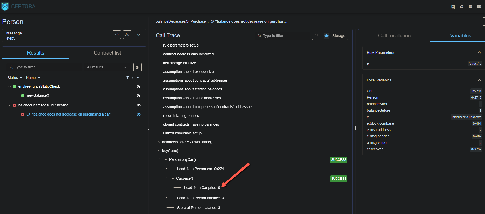

# Run Analysis

## Reports
### verifyStep3.sh: [Verification Report](https://prover.certora.com/output/52228/dd85b050e24f444582b373de78ed12f9?anonymousKey=d53bf038099e8aba7192cfbb95ddcb35583782dd) 

## Analysis
### verifyStep3.sh: 
  

Nope. Even with default initialization inside `Car.sol` of `price` to 10 by us, the Prover still creates a counter-example with `Car.price=0` ! 
How do we instruct the Prover to pick up the correct value of `price`?
