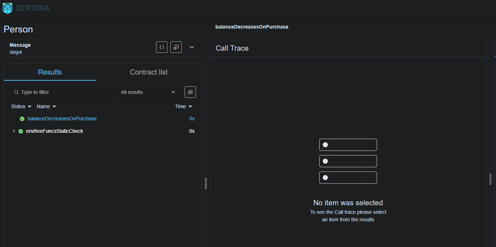

# Run Analysis

## Reports
### verifyStep4.sh: [Verification Report](https://prover.certora.com/output/52228/40c9e4f5c6644ba18d7f5ca9aaa7ab96?anonymousKey=d756cc3443be51ce7787ecb6b35ea0b05731ca1b) 

## Analysis
### verifyStep4.sh: 
  

Manually adding the `require` statement that the price of the car should always be 10 does the job for us. (Check updated rule `balanceDecreasesOnPurchase` in `person.spec`).  

Since the price of the car always remains 10, can we do this via `invariants`? No, because Certora Prover does not invoke constructors of external contracts while using `invariant` or `requireInvariant` (For detailed explanation, refer my GitHub Repo: [Certora-Invariants-Single-And-Multi-Contract-SelfExploration](https://github.com/syntax-namaste/Certora-Invariants-Single-And-Multi-Contract-SelfExploration)).
