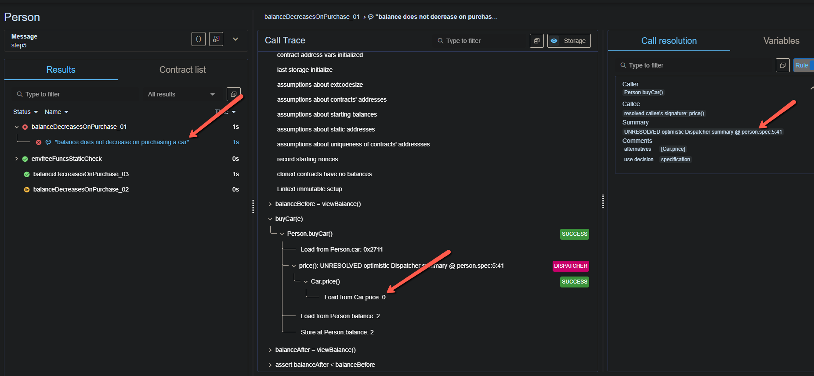
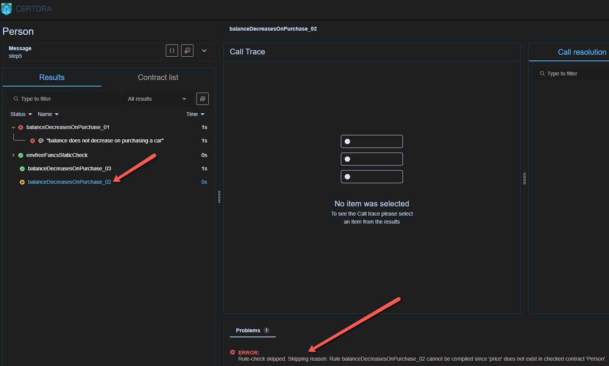

# Run Analysis

## Reports
### verifyStep5.sh: [Verification Report](https://prover.certora.com/output/49230/33cdbc67e7d942a8956033d86fdd4fbf?anonymousKey=a8ede172433c9698a6360c1f40d2e0dbf42ca90f) 

## Analysis
### verifyStep5.sh: 

  

Observe how removing the `--link` option from command line and referring to the `price()` function via a `DISPATCHER` in the spec file, causes the rules to pass & fail, based on usage of different mechanisms internally. 
The `DISPATCHER` resolves calls by assuming that the receiver address (of the function; in this case, `Car` for the funtion `price`) is one of the contracts in the scene that implements the called method (and so we still need to add the `Car` contract to the scene). It will try **every** option, and if any of them can cause a violation, it will report a counterexample. Refer: [Working with unknown contracts](https://docs.certora.com/en/latest/docs/user-guide/multicontract/index.html#working-with-unknown-contracts)  

Although this was a simple (and perhaps, forced) example, the `DISPATCHER` approach is helpful when working with unknown contracts, as explained in the reference link mentioned above.  

**NOTE:** 
`DISPATCHER(true)` is able to figure out the correct contract from the scene only if the call
to the function is NOT made directly from the spec file. It has to be from within a function of 
the currentContract, or a contract inherited by currentContract.